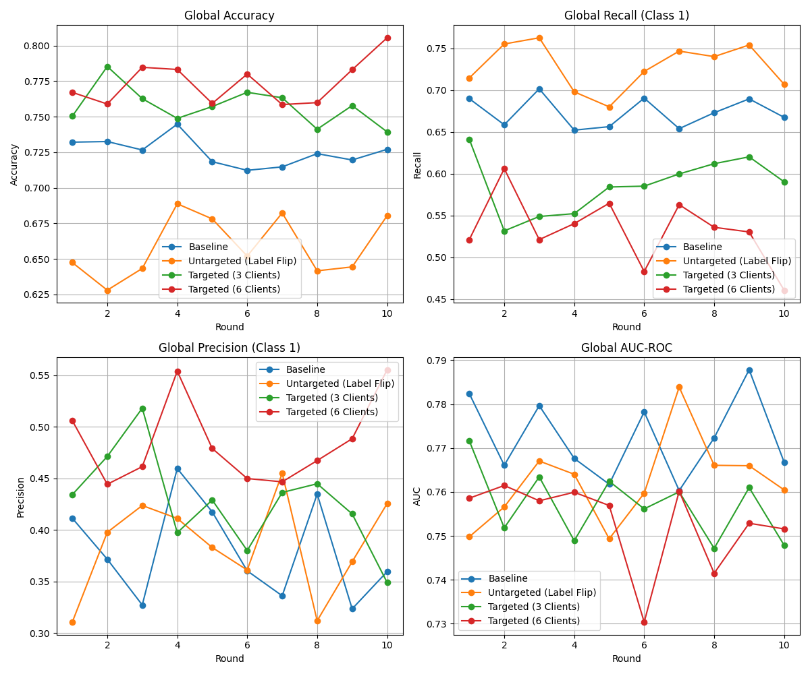
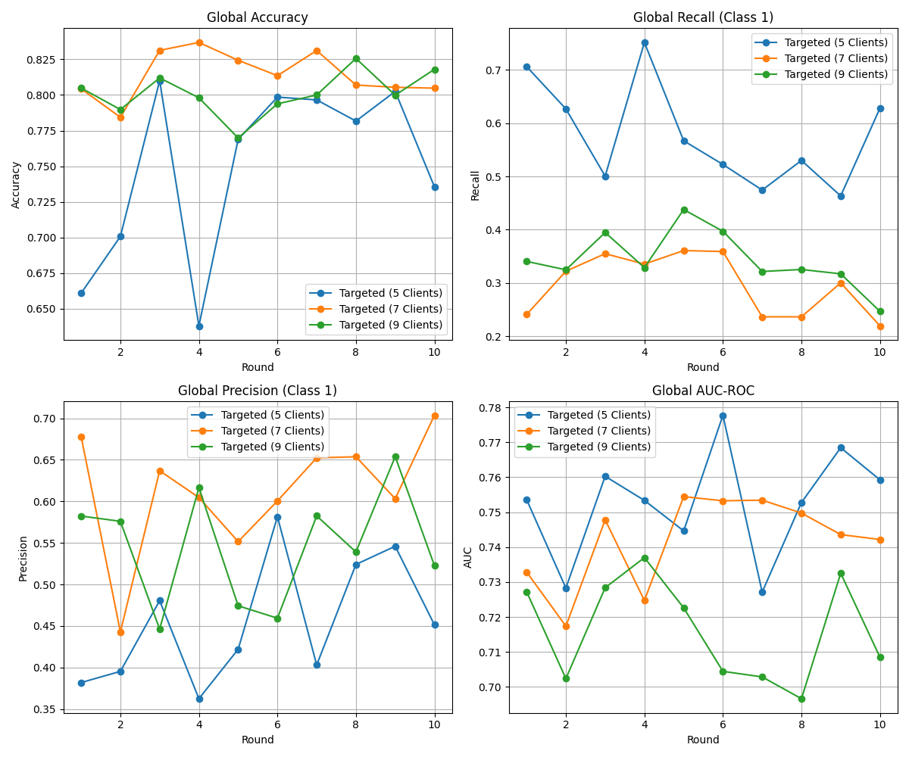

# Quantitative and Visual Analysis of Data Poisoning Attacks in Federated Learning Systems


-orange)

## 🏢 Executive Summary

This research project investigates the vulnerabilities of **Federated Learning (FL)** systems to data poisoning attacks in the financial domain. Specifically, it analyzes the impact of **Targeted Label Flipping** attacks on credit card default prediction models.

The study uncovers critical phenomena such as the **"Accuracy Paradox"**—where global accuracy rises while fraud detection capabilities collapse—and identifies the **"Clean Start Paradox"** in simulation environments. It further evaluates **FedMedian** as a robust aggregation defense, demonstrating its success against minority attacks and its theoretical breakdown point at the 50% Byzantine limit.

## 🚀 Key Features & Contributions

* **Non-IID Data Simulation:** Realistic partitioning of the UCI Credit Card Default dataset using Dirichlet Distribution ($\beta=3.0$) across 10 clients.
* **Attack Vectors:**
    * **Untargeted Attack:** Noisy label flipping ($0 \leftrightarrow 1$) causing DoS-like accuracy collapse.
    * **Targeted Attack (Stealthy):** Flipping only minority class labels ($1 \rightarrow 0$) to mask financial risk.
* **Technical Innovations:**
    * **Poisoned Initialization:** Solved the "Clean Start Paradox" by ensuring malicious clients initialize models with poisoned parameters.
    * **Dynamic Thresholding:** Implemented F1-score maximization to counter class imbalance.
* **Defense Mechanism:** Implementation of **FedMedian** (Coordinate-wise Median) to mitigate poisoning effects.
* **Visual Forensics:** Comprehensive analysis using t-SNE, Confusion Matrices, and ROC Curves.

## 📊 Experimental Results

### 1. The Accuracy Paradox
Under a targeted attack with 6 malicious clients, the system exhibits a dangerous anomaly: Global Accuracy rises to **~80%** (red line) while Recall collapses to **~10%**. The model learns to predict "Safe" for everyone, maximizing accuracy on the imbalanced dataset while failing its primary purpose.


*(Figure: Comparative Analysis of Attack Scenarios under Mean Aggregation)*

### 2. Defense Efficacy (FedMedian)
**FedMedian** successfully filters out malicious updates when attackers are in the minority (30% - Green Line), restoring Recall to baseline levels. However, it collapses when the attacker ratio exceeds the Byzantine tolerance limit (>50% - Red Line).


*(Figure: FedMedian Breakdown Point under Majority Attacks)*

## 🛠️ Installation & Usage

1.  **Clone the repository:**
     ```bash
    git clone [https://github.com/onurtturan/Analyzing-Poisoning-Attacks-and-Robust-Aggregation-Limits-in-Federated-Learning.git](https://github.com/onurtturan/Analyzing-Poisoning-Attacks-and-Robust-Aggregation-Limits-in-Federated-Learning.git)
    cd Analyzing-Poisoning-Attacks-and-Robust-Aggregation-Limits-in-Federated-Learning
     ```

2.  **Install dependencies:**
    ```bash
    pip install -r requirements.txt
    ```

3.  **Run the Simulation:**
    ```bash
    python src/main.py
    ```
    *Note: You can configure attack types and client numbers in `src/config.py` or via command line arguments.*

## 📂 Project Structure

* `src/`: Contains the core logic for Server, Client, and Dataset management.
* `data/`: Pre-processed UCI Credit Card dataset.
* `results/`: Generated plots for Accuracy, Recall, Precision, AUC, and Confusion Matrices.

## 👨‍💻 Author & Course Info

* **Author:** Onur Turan
* **Supervisor:** Ozan Zorlu
* **Date:** January 2026

---
*This project uses the [Flower](https://flower.dev/) framework for FL simulation.*
